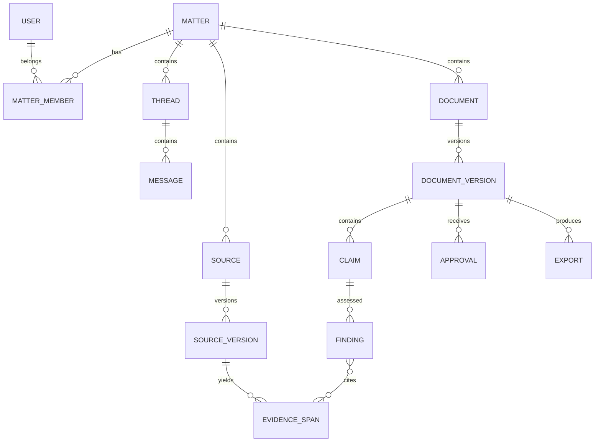

# Database and persistence design

## Principles

PostgreSQL is the system of record. Original binaries live in object storage; the database retains metadata and checksums. Every user-owned record carries a workspace/matter boundary. Documents are immutable versions. Findings and approvals attach to versions and claim hashes.

## Entity map



## Essential tables

Use UUIDs and timestamps; enums below may be database enums or checked text values.

```sql
create table matters (
  id uuid primary key,
  workspace_id uuid not null,
  title text not null,
  description text,
  created_by uuid not null,
  created_at timestamptz not null,
  updated_at timestamptz not null,
  archived_at timestamptz
);

create table matter_members (
  matter_id uuid references matters(id),
  user_id uuid not null,
  role text not null check (role in ('owner','editor','reviewer','viewer')),
  primary key (matter_id, user_id)
);

create table sources (
  id uuid primary key,
  matter_id uuid not null references matters(id),
  kind text not null,
  display_name text not null,
  status text not null,
  created_by uuid not null,
  created_at timestamptz not null
);

create table source_versions (
  id uuid primary key,
  source_id uuid not null references sources(id),
  version_no int not null,
  object_key text not null,
  sha256 text not null,
  mime_type text not null,
  size_bytes bigint not null,
  extraction_method text,
  extraction_version text,
  language text,
  page_count int,
  extracted_text jsonb,
  created_at timestamptz not null,
  unique(source_id, version_no), unique(source_id, sha256)
);

create table documents (
  id uuid primary key,
  matter_id uuid not null references matters(id),
  title text not null,
  kind text not null,
  current_version_id uuid,
  created_by uuid not null,
  created_at timestamptz not null
);

create table document_versions (
  id uuid primary key,
  document_id uuid not null references documents(id),
  version_no int not null,
  parent_version_id uuid,
  content_json jsonb not null,
  content_sha256 text not null,
  schema_version int not null,
  created_by_type text not null check (created_by_type in ('human','agent','system')),
  created_by_id text not null,
  created_at timestamptz not null,
  unique(document_id, version_no)
);
```

Add threads/messages; extraction jobs; agent runs/tasks/events; claims; evidence spans; findings; finding-evidence join; resolutions; approvals; exports; audit events; and idempotency keys. Do not store all of these as one unqueryable JSON blob.

## Claims and findings

`claims` stores exact range/annotation ID, text, normalized structured proposition, and `claim_sha256`. `evidence_spans` stores source version, page, character offsets, exact text, and extraction confidence if applicable. `findings` stores dimension, status, severity, method, model/tool version, checked time, limitations, and stale time. A join table gives each evidence link a relation such as supports, contradicts, mentions, or source-of-quote.

A resolution stores actor, action, optional replacement text, required reason for waiver/retain, and timestamp. Resolution does not overwrite machine finding history.

## Version writes

Client sends `base_version_id`, steps/JSON update, and idempotency key. In one transaction:

1. Lock document row.
2. Confirm current version equals base version; otherwise return 409.
3. Validate Tiptap schema and all embedded reference IDs.
4. Insert version and update current pointer.
5. Mark related prior findings stale and clear approvals.
6. Append audit event and enqueue checks.

## Authorization

Every data query joins through matter membership or uses database row-level security as defense in depth. Object keys are opaque and authorization is checked before signing a download. SSE task/event queries must also verify matter membership. Search must never index or return another matter's content.

Cedar can express owner/reviewer policies, but the application must fail closed if policy evaluation is unavailable. Cedar separates policy from business code and evaluates allow/deny requests. [Cedar concepts](https://docs.cedarpolicy.com/)

## Retention and deletion

For the hackathon, implement matter delete as a queued hard delete for database rows and object keys, with visible completion/failure. Production would need configurable retention, legal hold, backups, recovery objectives, encryption key policy, and regional/privacy review.
