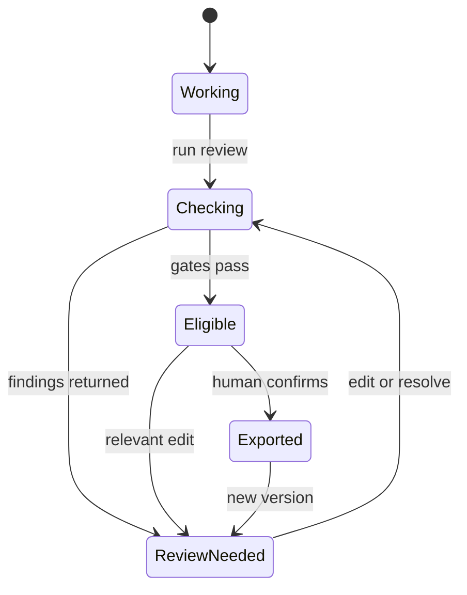

# Product and system flows

## 1. Create matter and ingest sources

1. User creates a matter and supplies a short description.
2. User uploads PDF, DOCX, PNG/JPEG, or text; client performs basic size/type checks.
3. Backend creates a source record and returns a scoped upload target.
4. File is stored under an opaque key, scanned if available, hashed, and queued.
5. Extractor records page-aware text. Native PDF/DOCX parsing is preferred; OCR is used for images/scans.
6. Parser produces candidate propositions with evidence spans. User can correct extraction.
7. Source becomes `ready`, `needs_review`, `unsupported_language`, or `failed`.

Amazon Textract can serve the English cloud path, but its documented text detection languages exclude Hindi. Synchronous PDF/TIFF handling is also limited to one page and 10 MB, so multipage PDFs require asynchronous processing or a local parser. [AWS limits](https://docs.aws.amazon.com/textract/latest/dg/limits-document.html)

## 2. Main-agent conversation

1. Message is saved under a matter-scoped thread.
2. Orchestrator loads authorized matter metadata, selected sources, current document version, and unresolved findings.
3. It classifies intent into answer, draft, citation review, fact review, or combined workflow.
4. It requests missing material facts rather than filling them.
5. Each specialist call has an explicit task, allowed source IDs, document version, tool set, and budget.
6. Structured results stream as events; validated document operations create an artifact/version.
7. Main agent explains what ran and what remains unresolved.

## 3. Draft generation

1. Writer receives a draft brief: document kind, user instructions, extracted propositions, permitted legal passages, and unresolved slots.
2. Writer returns a structured DraftPlan and block operations, with every factual/legal claim pointing to candidate evidence IDs or marked unsupported.
3. Backend validates schema and ownership of every reference.
4. Backend stores a new document version; the UI may show pending claims.
5. Citation and fact scans run against the immutable version.
6. Findings attach to stable annotation IDs and evidence spans.

The model should not emit arbitrary full Tiptap JSON into the database. It emits typed operations from an allowlist, which the server converts to valid Tiptap content.

## 4. Citation review

1. Extract explicit case/statute references and the proposition each allegedly supports.
2. Normalize citation tokens only for candidate search; preserve original text.
3. Search the curated local corpus, official court sources, statute source, and optional Indian Kanoon adapter.
4. Resolve identity using multiple fields: court, date/year, case/cause title, number/reporter citation.
5. When quoting, compare normalized quote to the retrieved passage and save the exact passage/page.
6. Assess proposition support independently using a constrained model or reviewer heuristic; label it an assessment.
7. Check later treatment only if a supported data source was actually queried. Otherwise show Not checked.
8. Store one finding per dimension. A found case can still have a quote mismatch or unsupported proposition.

## 5. Factual consistency review

1. Break draft text into propositions: subject, relation/event, object/value, date, qualifiers.
2. Retrieve evidence spans from authorized client sources.
3. Compare values with normalized units and dates; retain original strings.
4. Return supported, contradicted, missing evidence, ambiguous, or source conflict.
5. Show all conflicting record passages; user resolves them and records a reason.
6. The tool never declares the underlying real-world fact true solely because a document says it.

## 6. Editing and invalidation

1. Client submits a step/document update with base version and idempotency key.
2. Server creates a new immutable version and returns it.
3. Claim hashes are recomputed. Findings whose relevant claim/evidence changed become stale.
4. Document-level human approval is cleared.
5. Rechecks run only for affected claims when possible.

## 7. Export

1. User selects export type and current version.
2. Server executes authorization and the version-specific policy gate.
3. Renderer generates from canonical JSON using the server's extension schema.
4. PDF gets a deterministic layout and footer containing document version and generation time.
5. JSON package contains content, sources manifest, findings summary, and audit excerpt; uploaded binaries are excluded unless separately requested.
6. Export record stores checksum and policy result, then a short-lived download link is returned.

Tiptap officially supports JSON/HTML persistence and server-side rendering utilities. JSON remains canonical because custom annotation nodes must survive a round trip. [Persistence](https://tiptap.dev/docs/editor/core-concepts/persistence) · [Static renderer](https://tiptap.dev/docs/editor/api/utilities/static-renderer)

## 8. Reviewed export state machine

Saving and draft export remain available from Working and ReviewNeeded. Only the current eligible version can produce a reviewed export.
