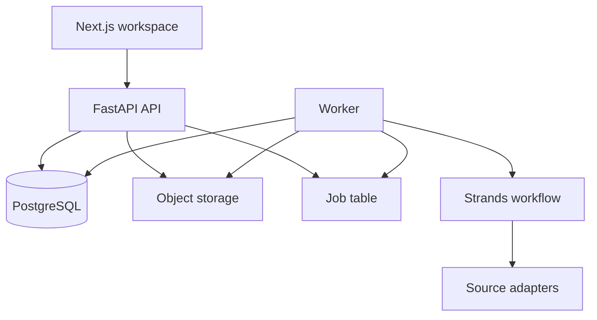

# Technical architecture

## Recommended hackathon stack

| Layer | Choice | Purpose |
|---|---|---|
| Web | Next.js + TypeScript + Tailwind + Radix/shadcn primitives | Three-pane UI and accessible components |
| Editor | Tiptap / ProseMirror | Canonical structured document and custom annotations |
| Server | FastAPI + Pydantic | APIs, streaming, authorization hooks, agent execution |
| Agent SDK | Strands Agents SDK | Main agent and specialists as tools |
| Database | PostgreSQL | Product records, JSONB document versions, full-text search |
| Object store | S3-compatible storage; MinIO locally | Original uploads, previews, exports |
| Jobs | PostgreSQL job table + worker for MVP | Extraction, review, export without Redis complexity |
| Local AWS tool | OpenSearch only if integrated in core retrieval | Sponsor-aligned search after core SQL path works |
| Policy | Cedar for demonstrable authorization rules, backed by mandatory application checks | Central policy examples and deny decisions |
| Observability | Structured JSON logs + task/event tables | Trace workflow without storing hidden reasoning |
| PDF | Playwright/Chromium print from a controlled HTML template | Predictable typography and page layout |
| Tests | Pytest + Vitest/Playwright | Contract, gate, isolation, and hero-flow coverage |

Use current stable versions at kickoff and commit lockfiles. Do not prescribe “Next.js 16” or another future-sensitive version before checking compatibility.

## Runtime architecture



The browser never receives object-store credentials, model keys, or unrestricted source URLs. SSE endpoints replay persisted task events using an event cursor. Long extraction and review jobs run outside request lifetimes.

## Retrieval design

For the small curated MVP corpus, use PostgreSQL exact fields and full-text search. Citation normalization and multiple identifiers find candidates. Embeddings and OpenSearch are optional after measuring a concrete retrieval gap. A 10-case demo corpus does not need pgvector, Redis, Aurora, DynamoDB, EventBridge, and OpenSearch simultaneously.

Candidate ranking can combine exact citation match, case number, court/year, normalized title similarity, and text search. Confirmation requires corroborated fields and stored source evidence; the rank itself is never the verification result.

## AWS requirement and track choice

The rules require AWS use and the demo must show it. Build It explicitly lists open-source AWS projects including Strands, Cedar, SAM/LocalStack, and OpenSearch. The proposed baseline uses Strands directly; add Cedar or OpenSearch only through a real, visible feature. [Rules](https://www.wemakedevs.org/aws/first-commit/rules) · [Event stack](https://www.wemakedevs.org/aws/first-commit)

Recommended submission: **Build It + Best UI**. A Ship It entry requires a live AWS URL, and cloud architecture/cost decisions are part of its score. Attempt deployment only after the core loop, security boundary, and video path work. This is not a one-flag conversion.

### Optional Ship It deployment

- Frontend: Amplify Hosting or CloudFront/S3 where suitable.
- API/worker: App Runner/ECS for consistent streaming and document tooling, or Lambda only after package/runtime validation.
- Storage: RDS PostgreSQL plus S3.
- Auth: Cognito if time permits; otherwise a well-tested application auth provider.
- Inference: Bedrock via the same application model interface.
- Secrets: Secrets Manager; logs and alarms in CloudWatch.

Avoid Aurora Serverless plus DynamoDB split for this MVP. One PostgreSQL store preserves transactionality across version, findings, approval, and export gate.

## Model setup

The build assistant and application runtime are separate. Use Astra in Codex for difficult architecture, debugging, integration, and review; use a faster coding model for routine implementation and tests. The application itself needs a provider API or local model. ChatGPT sign-in usage is governed by the plan; API-key usage is billed through the API account. [OpenAI authentication](https://learn.chatgpt.com/docs/auth)

At kickoff, run 10 fixed tasks against available models: two draft sections, citation extraction, proposition extraction, conflict detection, missing-fact behavior, prompt-injection fixture, malformed output, long passage, and tool timeout. Score schema validity, evidence precision, unsupported assertions, latency, and cost. Select providers from results.

If choosing OpenAI for the app, current official guidance exposes Astra through the Responses API and supports structured outputs/tool use; availability and pricing are account-specific and must be checked before committing. [Model guidance](https://developers.openai.com/api/docs/guides/latest-model)

## Repository after kickoff

```text
veritas/
  apps/web/
  services/api/
  services/worker/
  packages/contracts/
  packages/editor-schema/
  infra/local/
  data/demo/              # synthetic/redacted fixtures and manifests
  tests/fixtures/
  docs/                   # this pack
  README.md
```

Because rules prohibit pre-event project work, create the actual implementation repository when the clock starts. Planning and practice are explicitly allowed. [Rules](https://www.wemakedevs.org/aws/first-commit/rules)
