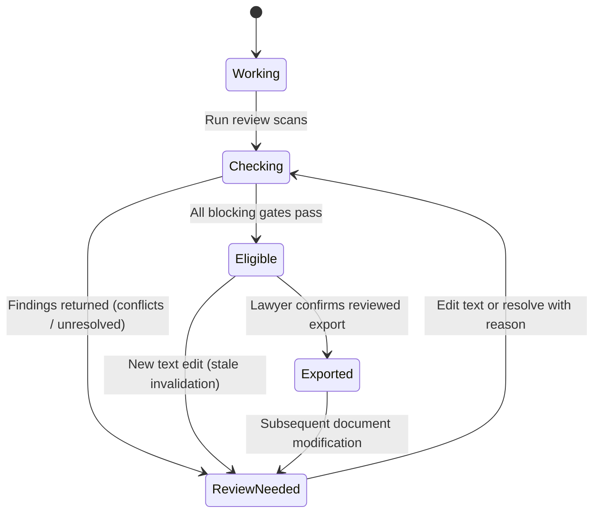

# Veritas Application and System Flows

Veritas structures drafting and verification as an application-controlled workflow. Orchestration is handled by a Main Agent using the Strands Agents SDK (AWS open source), which invokes three specialized roles: Writer Agent, Citation Reviewer, and Fact Reviewer.

## 1. Matter Creation and Source Ingestion Flow

```text
Lawyer creates matter & uploads files (PDF, DOCX, PNG/JPEG)
  │
  ▼
Backend creates matter record & generates scoped upload target
  │
  ▼
File is saved, hashed (SHA-256), and queued for extraction
  │
  ▼
Extraction Engine parses page-aware text:
  - Native text extraction for digital PDF/DOCX
  - OCR for scanned records and images
  - Generates structured Client Intake JSON with page character offsets
  ▼
Source status updated: ready, needs_review, unsupported, or failed
```

Client-uploaded documents (loan agreements, default notices, bank statements) form the exclusive factual ground truth for that matter.

## 2. Main Agent Orchestration Flow

```text
User submits instruction in matter thread
  │
  ▼
Main Agent loads matter context, selected sources, and active document version
  │
  ▼
Main Agent generates a typed WorkflowPlan:
  - Intent classification: draft, revise, citation_review, fact_review
  - Source IDs and active document version ID
  - Bounded specialist steps with tool budgets
  ▼
Executor validates ownership and permissions before running tasks
  │
  ▼
Structured events stream to client via Server-Sent Events (SSE)
  │
  ▼
Main Agent summarizes results; editor canvas displays candidate artifact
```

The Main Agent coordinates tasks and explains findings. It never invents legal authorities, marks findings resolved, or modifies documents without schema validation.

## 3. Draft Generation Flow

```text
Writer Agent receives drafting brief:
  - Matter type and user instructions
  - Extracted client propositions with evidence span IDs
  - Curated statutory provisions and precedent passages
  ▼
Writer Agent emits allowlisted block operations:
  - insertBlock, replaceText, addCitationRef, addFactRef, setHeading
  - Every factual or legal assertion links to candidate evidence IDs
  ▼
Server validates operation schema, node types, and reference ownership
  │
  ▼
Server commits new immutable DocumentVersion to PostgreSQL
  │
  ▼
Citation and Fact checks are triggered against the immutable version
```

The Writer Agent never emits unvalidated raw HTML directly into the database. All operations pass through strict server-side schema filters.

## 4. Citation Review Flow

```text
Citation Reviewer inspects all citationRef annotations in active version
  │
  ▼
Dimension 1: Identity Check
  - Matches citation against curated local corpus and official sources
  - Resolves court, year, cause title, and reporter citation
  - Not found in verified sources -> marked Unresolved (blocked from reviewed export)
  ▼
Dimension 2: Exact Quotation Check
  - Compares quoted excerpt against retrieved authentic judgment text
  - Identifies word omissions, substitutions, or fabricated sentences
  - Result: Quotation Supported or Quotation Mismatch
  ▼
Dimension 3: Proposition Support Assessment
  - Examines whether the judicial ratio actually supports the asserted claim
  - Labeled explicitly as a model assessment requiring human review
  ▼
Dimension 4: Subsequent Treatment Check
  - Checks whether the ruling has been distinguished, reversed, or overruled
  - Marked as "Not checked" if authentic citator data is unavailable
```

Citations are not evaluated as a single yes/no score. A case may exist (identity verified) while containing a fabricated quote (quotation mismatch). Veritas records these as distinct findings.

## 5. Factual Consistency Review Flow

```text
Fact Reviewer breaks draft paragraphs into atomic propositions:
  - Subject, relation/event, financial amount, date, qualifiers
  ▼
Retrieves candidate evidence spans from uploaded client records
  │
  ▼
Compares extracted draft values against client intake text
  │
  ▼
Finding generated:
  - Supported: figures and dates align with client records
  - Contradicted / Conflict: discrepancies detected between draft and records,
    or between two conflicting client records (e.g. Rs. 4.85 Cr vs. Rs. 5.20 Cr)
  - Missing Evidence: assertion has no backing in the client file
  ▼
Discrepancy rendered in Evidence Drawer:
  - Shows excerpts from conflicting source documents side by side
  - Lawyer selects preferred value and records a mandatory reason
```

Veritas highlights discrepancies for lawyer decision-making. It never unilaterally declares which client document is correct.

## 6. Editing and Invalidation Flow (Stale Detection)

```text
Lawyer edits text in Tiptap editor canvas
  │
  ▼
Client sends draft update with base_version_id and idempotency key
  │
  ▼
Server creates a new immutable DocumentVersion (e.g. Version 2)
  │
  ▼
Server recalculates claim content hashes:
  - Unaffected claims retain their previous review findings
  - Modified claims have their findings marked as "Stale"
  - Document-level human approval is immediately revoked
  ▼
Evidence Drawer and Trust Strip update:
  - Displays "Stale: requires re-check after edit"
  - Lawyer re-runs checks for affected sentences
```

This prevents outdated verification statuses from surviving subsequent edits. A green checkmark only applies to the exact text that was evaluated.

## 7. Gated Export Flow

```text
Lawyer requests export (Draft PDF, Reviewed PDF, or JSON package)
  │
  ▼
Server evaluates authorization and version-specific policy gate:
  - Is this the current document version?
  - Are all citation identity and quotation checks complete?
  - Are there any unresolved or contradictory blocking findings?
  - Are there any stale findings requiring re-verification?
  - Has a human lawyer recorded approvals/reasons?
  ▼
Decision:
  - Draft Export: Always permitted; embeds prominent DRAFT watermarks
    and appends an Unresolved Findings Appendix.
  - Reviewed Export: Permitted only if all policy criteria pass.
    Rejects with clear list of blocking items if criteria fail.
```

## 8. Reviewed Export State Machine


