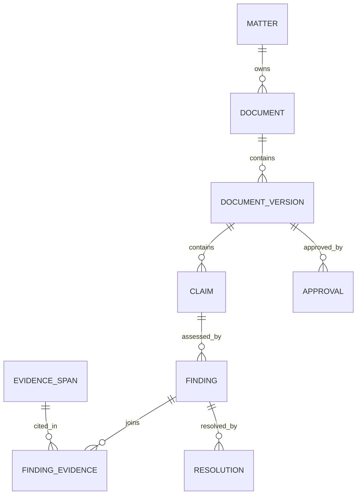
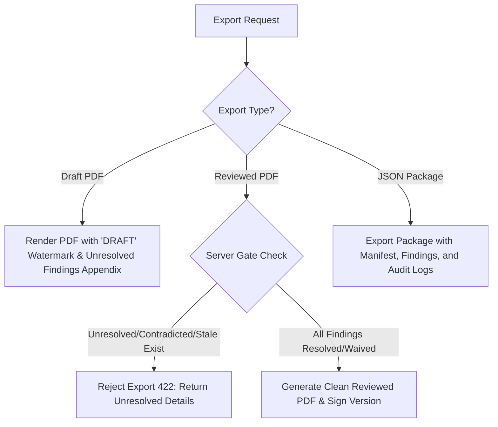

# Review Findings Architecture & Feature Specification

## 1. Overview & Core Philosophy

In **Veritas Agent**, review findings form the core of the evidence-first legal review engine. Built specifically for complex legal drafting (such as Indian IBC Section 7 petitions and working briefs), Veritas ensures that every assertion—whether a client fact, legal proposition, or statutory citation—is systematically audited against established matter records and authoritative legal sources.

### Core Principles
- **Evidence-First Guarantee**: No claim exists in isolation. Findings tie exact draft claims directly to page-aware source evidence spans.
- **No Fake Trust Scores**: Veritas never averages legal risk or displays speculative "94% confidence" badges. Review progress is tracked strictly by explicit counts across discrete finding states (e.g., *3 contradicted, 2 unresolved, 8 supported*).
- **Human Authority**: Models and automated tools only propose typed findings. Only an authenticated human lawyer can accept, override, waive, or approve findings and documents.
- **Transactional Invalidation**: Editing a document creates a new immutable version and immediately invalidates any prior findings attached to modified content, transitioning them to a `stale` state and clearing document approval.

---

## 2. Domain Data Model & Entity Lifecycle

Review findings are stored in PostgreSQL as relational entities tied to specific document versions.



### Core Entities

1. **Claim (`claims`)**:
   - Represents a specific span or annotation within a Tiptap document version.
   - **Kinds**: `client_fact`, `legal_proposition`, `quotation`, `citation`.
   - Contains: `claim_id`, `document_version_id`, `block_id`, `from`, `to`, `text`, normalized proposition, and `claim_sha256`.

2. **Evidence Span (`evidence_spans`)**:
   - Represents an extracted text segment from an uploaded client file or legal authority.
   - Contains: `span_id`, `source_id`, `source_version_id`, `page_number`, `char_start`, `char_end`, `exact_text`, and `extraction_confidence`.

3. **Finding (`findings`)**:
   - Machine or human evaluation of a claim against evidence along a single evaluation dimension.
   - Contains: `finding_id`, `claim_id`, `dimension`, `status`, `severity`, `method` (`exact`, `normalized`, `retrieval`, `model_assessment`, `human`), `model_version`, `checked_at`, `limitations`, and `stale_at`.

4. **Finding-Evidence Link (`finding_evidence`)**:
   - Join entity defining the relationship between a finding and an evidence span.
   - **Relations**: `supports`, `contradicts`, `mentions`, `source_of_quote`.

5. **Resolution (`resolutions`)**:
   - Audit record of a human decision regarding a finding.
   - Contains: `resolution_id`, `finding_id`, `actor_id`, `action` (`accept_suggestion`, `keep_with_reason`, `replace_text`, `remove_claim`), `replacement_text`, `waiver_reason`, and `created_at`.
   - *Invariant*: Human resolutions do not overwrite historical machine finding records; they append a new audit resolution.

---

## 3. Finding Dimensions & Specialist Agents

Findings are generated across specific review dimensions by specialized agent roles operating under strict main-agent orchestration.

### Citation Reviewer Dimensions
Evaluates legal references (case law, statutes, regulations) against authoritative sources.

| Dimension | Description | Success Criteria | Contradiction Criteria |
|---|---|---|---|
| **Identity** | Validates case title, citation format, court, and date against legal databases. | Citation matches official registry/reporter format. | Non-existent citation or wrong court/date. |
| **Exact Quotation** | Compares quoted extract in draft against original judgment text. | Character-accurate or acceptable normalized match. | Text omission, word substitution, or false quote. |
| **Proposition Support** | Assesses if cited precedent ratio supports the drafted proposition. | Precedent directly supports legal assertion. | Precedent does not support or holds opposite view. |
| **Later Treatment** | Checks subsequent judicial history of cited authority. | Precedent remains good law / affirmed. | Precedent overruled, reversed, or distinguished. |

### Fact Reviewer Dimensions
Evaluates client statements against uploaded matter records (e.g., loan agreements, bank statements, default notices).

| Dimension | Description | Success Criteria | Contradiction Criteria |
|---|---|---|---|
| **Fact Consistency** | Cross-checks dates, default amounts, party names, and sequence of events across multiple records. | Draft facts match all uploaded source records. | Conflicting default dates or amounts between Record A (invoice) and Record B (bank statement). |

---

## 4. Finding States & Visual Indicators

### Status Values
- **`supported`**: Claim verified by source evidence.
- **`contradicted`**: Claim conflicts with source evidence or statutory authority.
- **`unresolved`**: Evidence missing, ambiguous, or retrieval failed.
- **`needs_review`**: Automated check flags potential discrepancy requiring human evaluation.
- **`stale`**: Document or underlying evidence modified after finding was generated.
- **`resolved`**: Finding reviewed and accepted by human user.
- **`waived`**: Finding acknowledged by user and kept with documented justification.

### Visual & Accessibility Standards
Findings are never communicated through color alone. Every indicator pairs **Color + Icon + Descriptive Text**:

```
[✓ Supported]       Green  - Check completed and verified
[⚠ Needs Review]    Amber  - Review needed / unresolved / incomplete coverage
[✗ Contradicted]    Red    - Contradiction / quote mismatch / fact conflict
[○ Not Checked]     Gray   - Check not run / unavailable
```

---

## 5. UI/UX: Review Queue & Evidence Drawer

The review workflow is integrated into the 3-pane matter workspace (`apps/web`).

```
+------------------+------------------------------------+------------------------------------+
| Matter Rail      | Document Canvas (Tiptap)           | Review Queue & Evidence Drawer     |
| (232 px)         |                                    |                                    |
|                  | "The Corporate Debtor defaulted    | [ Filter: All | Blocking | Stale ]  |
|                  |  on INR 5,50,00,000 on Jan 15..."  |                                    |
|                  |       [⚠ Fact Conflict]            | ---------------------------------- |
|                  |                                    | ✗ Fact Consistency Conflict        |
|                  |                                    |   Record A says INR 5.5 Cr         |
|                  |                                    |   Record B says INR 5.0 Cr         |
|                  |                                    |   [ Open Evidence Drawer ]         |
+------------------+------------------------------------+------------------------------------+
```

### 1. The Review Queue Pane
- **Location**: Right-hand panel of the workspace or toggleable drawer.
- **Filter Controls**: `All`, `Blocking`, `Needs Review`, `Unresolved`, `Stale`, `Resolved`.
- **Item Summary**: Displays finding title, dimension badge, status, and concise plain-language summary.
- **Interaction**: Clicking any finding in the queue scrolls the document directly to the highlighted claim span and opens the **Evidence Drawer**.

### 2. The Evidence Drawer
- **Purpose**: In-context side-by-side inspection without closing the document.
- **Key Sections**:
  1. **Header**: Finding dimension label, status tag, and plain-language explanation.
  2. **Draft Claim**: Exact sentence from current document version.
  3. **Evidence Passage**: Extracted passage from source file, displaying source title, page number, and paragraph.
  4. **Source Viewer**: Embedded PDF/document preview centered on the cited page and highlighted span.
  5. **Method & Limitations**: Explains check methodology (e.g. *Exact match check* vs *Model evaluation*) and noted limitations.
  6. **Action Bar**:
     - `[ Use Suggestion ]`: Applies recommended correction to draft.
     - `[ Keep with Reason ]`: Waives finding with mandatory justification text.
     - `[ Edit Sentence ]`: Focuses editor on target claim.
     - `[ Remove Claim ]`: Deletes statement/citation.
     - `[ Open Source ]`: Opens full document in viewer.

### 3. Citation Matrix View
For legal citations, displays a 4-row verification breakdown:
- `Identity`: Verified ✓
- `Quotation`: Mismatch ✗ (Draft missing phrase: *"without prejudice"*)
- `Support`: Supported ✓
- `Later Treatment`: Good Law ✓

---

## 6. Stale-on-Edit & Invalidation Dynamics

To maintain strict legal integrity, Veritas implements **Stale-on-Edit**:

1. **Document Content Edit**:
   - User or Writer agent modifies text in the Tiptap canvas.
   - Client sends edit to backend with `base_version_id`.
2. **Version Creation & Row Locking**:
   - Server locks document row in a PostgreSQL transaction.
   - Checks `current_version == base_version_id` (optimistic concurrency lock).
   - Saves new immutable `DOCUMENT_VERSION` row.
3. **Automatic Invalidation**:
   - Re-computes `claim_sha256` for claims.
   - Any prior findings associated with changed text ranges or altered evidence spans transition immediately to `status = 'stale'`.
   - Any existing `DOCUMENT_APPROVAL` for the version is cleared.
4. **UI Notification**:
   - Review Queue updates badge: `2 findings stale - rerun checks required`.
   - Export gates automatically lock for reviewed exports.

---

## 7. Server-Side Export Gates & Safety

Veritas enforces clear rules for document exports based on finding status:



- **Draft PDF Export**: Always available. Appends a mandatory watermark: `"WORKING DRAFT — REQUIRES PROFESSIONAL REVIEW"` and embeds a complete appendix of all unresolved, contradicted, or stale findings.
- **Reviewed PDF Export**: Protected by a transactional server-side gate. If any unresolved, contradicted, or stale findings remain without explicit human resolution, the server rejects the request with HTTP `422 Unprocessable Entity` listing blocking finding IDs.
- **JSON Package Export**: Complete evidentiary bundle containing canonical Tiptap content, source manifest, claim-finding join tables, resolution history, and SHA-256 checksums.

---

## 8. Key API Endpoints & Real-time SSE Events

### REST API Endpoints

```http
GET /api/document-versions/{id}/findings?status=unresolved
```
Returns filtered list of findings for a specific document version.

```http
POST /api/findings/{id}/resolutions
Content-Type: application.json

{
  "action": "keep_with_reason",
  "waiver_reason": "Court precedent applies despite factual variance in date."
}
```
Records human resolution and updates finding state.

```http
POST /api/document-versions/{id}/check
Content-Type: application.json

{
  "dimensions": ["citation_review", "fact_consistency"]
}
```
Enqueues background review jobs via Citation & Fact Reviewer agents.

### Server-Sent Events (SSE)
- `event: finding.created`: Emitted when review agent outputs new finding.
- `event: finding.updated`: Emitted on human resolution or waiver.
- `event: finding.stale`: Emitted when document edit invalidates existing findings.
